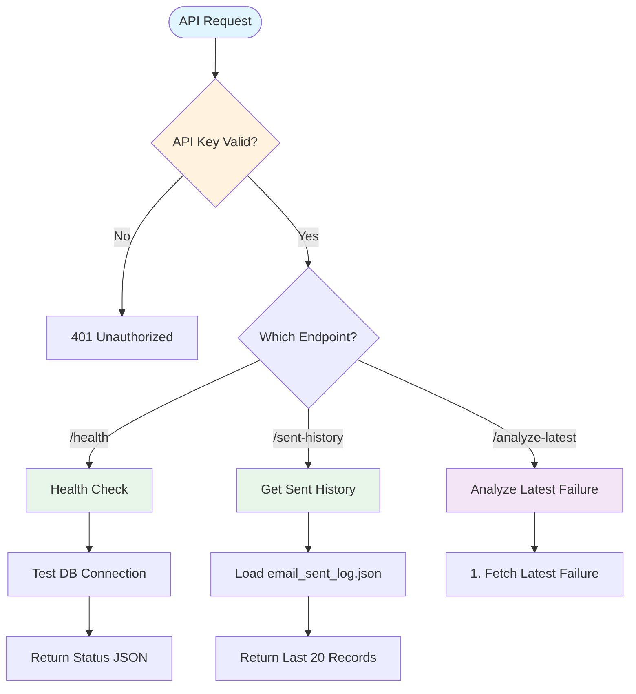
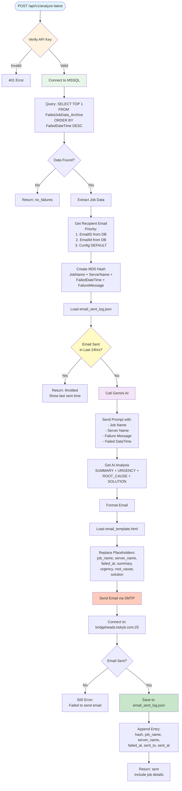
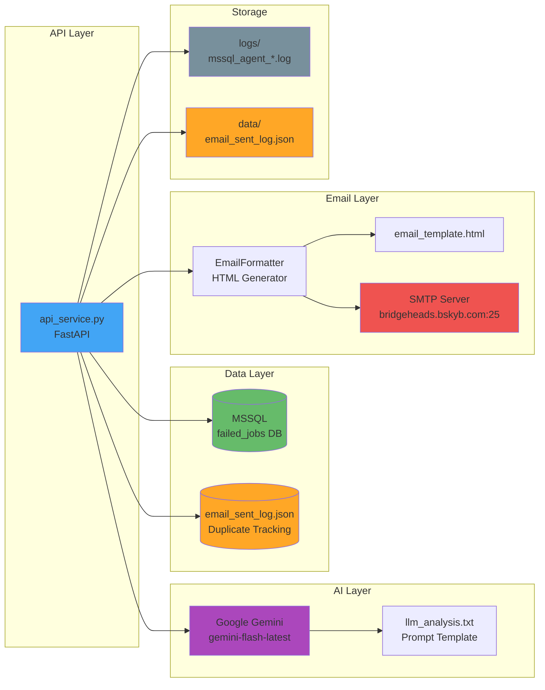
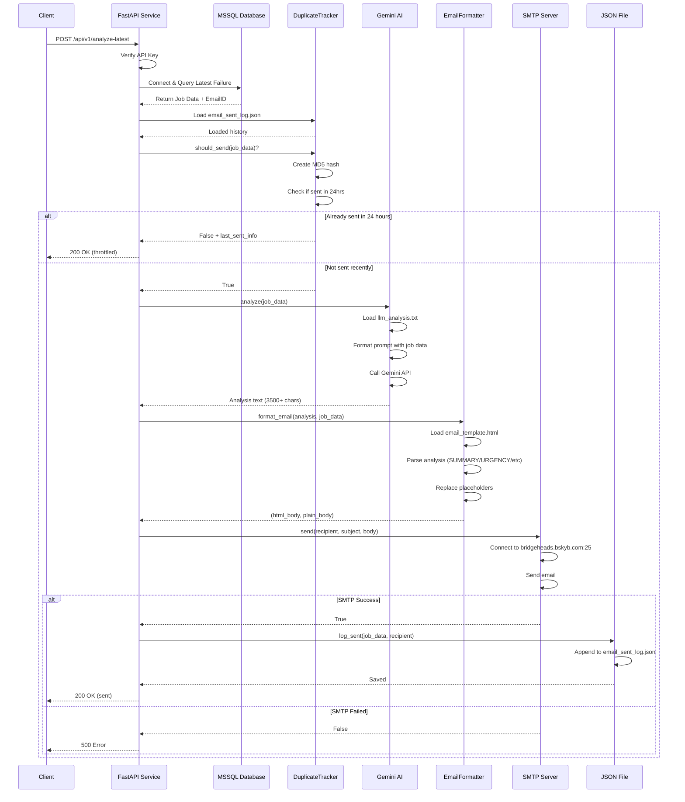
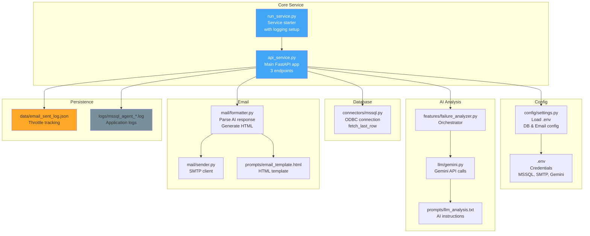

# MSSQL Failure Intelligence Agent - Architecture Flow

## System Overview



## Analyze Latest Failure - Detailed Flow



## Component Interactions



## Data Flow Sequence



## File Structure & Purpose



## Key Logic Components

### 1. DuplicateTracker Class
- **File**: `api_service.py`
- **Purpose**: Prevent duplicate emails within 24 hours
- **Methods**:
  - `create_hash()`: MD5 hash from job data
  - `should_send()`: Check if email sent in last 24hrs
  - `log_sent()`: Save sent email record
  - `get_recent_sent()`: Return history

### 2. MSSQLConnector Class
- **File**: `connectors/mssql.py`
- **Purpose**: Connect to MSSQL database
- **Methods**:
  - `test_connection()`: Health check
  - `fetch_last_row()`: Get latest failure

### 3. FailureAnalyzer Class
- **File**: `features/failure_analyzer.py`
- **Purpose**: Coordinate AI analysis
- **Methods**:
  - `analyze()`: Send job data to Gemini AI

### 4. GeminiProvider Class
- **File**: `llm/gemini.py`
- **Purpose**: Interact with Gemini API
- **Methods**:
  - `format_prompt()`: Fill template with job data
  - `generate()`: Call Gemini API

### 5. EmailFormatter Class
- **File**: `mail/formatter.py`
- **Purpose**: Generate HTML email
- **Methods**:
  - `format_email()`: Parse AI response, generate HTML
  - `_format_solution()`: Detect SQL code blocks

### 6. EmailSender Class
- **File**: `mail/sender.py`
- **Purpose**: Send email via SMTP
- **Methods**:
  - `send()`: Connect to SMTP and send

## Environment Configuration

```ini
# Database
MSSQL_SERVER=localhost
MSSQL_DATABASE=failed_jobs
MSSQL_USERNAME=sa
MSSQL_PASSWORD=***
MSSQL_DRIVER=ODBC Driver 18 for SQL Server

# Email
SMTP_SERVER=bridgeheads.bskyb.com
SMTP_PORT=25
SENDER_EMAIL=manojkumar.selvakumar@sky.uk

# AI
GEMINI_API_KEY=AIzaSy***
GEMINI_MODEL=gemini-flash-latest

# API Security
API_KEY=sky-mssql-agent-2025-secret
PORT=8000
```

## Throttle Logic Example

```
Time: 10:00 AM - Job fails, email sent
Hash: abc123 saved to email_sent_log.json

Time: 2:00 PM - Same job fails again
Check: abc123 found, sent_at = 10:00 AM
Diff: 4 hours < 24 hours
Action: Block email, return "throttled"

Time: 10:01 AM (next day) - Same job fails
Check: abc123 found, sent_at = 10:00 AM yesterday
Diff: 24 hours 1 minute > 24 hours
Action: Allow email, send again
```

## API Usage Examples

### 1. Health Check
```bash
curl http://localhost:8000/api/v1/health
```

### 2. Analyze Latest Failure
```bash
curl -X POST http://localhost:8000/api/v1/analyze-latest \
  -H "X-API-Key: sky-mssql-agent-2025-secret"
```

### 3. Get Sent History
```bash
curl http://localhost:8000/api/v1/sent-history?limit=10 \
  -H "X-API-Key: sky-mssql-agent-2025-secret"
```
